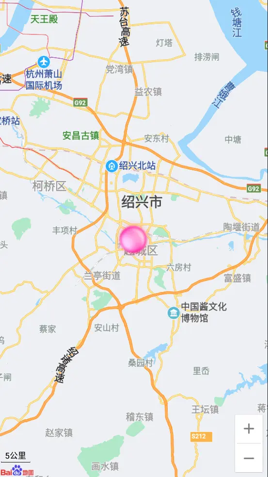
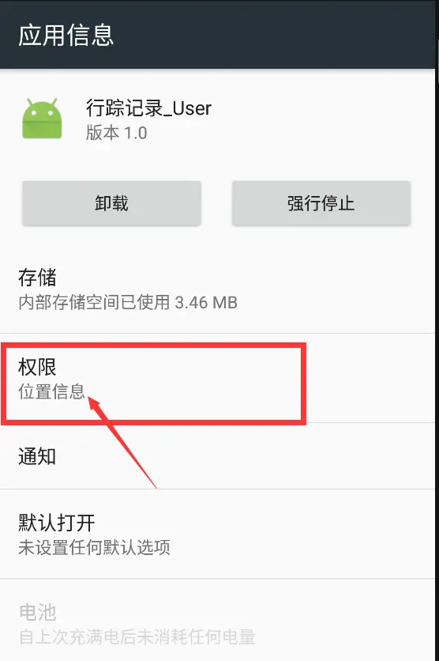
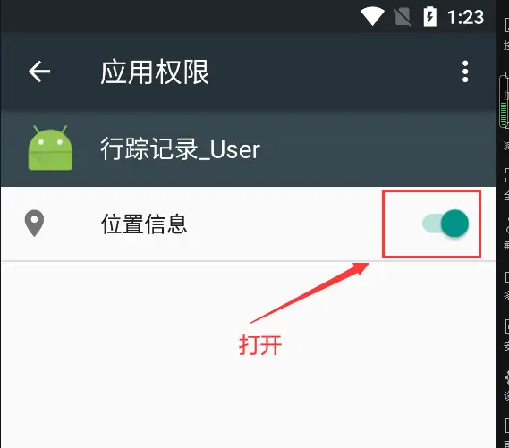

# 基于Android的行踪记录器

## 介绍

该系统是一个基于Android的行政记录器，目的是对用户的定位信息进行监控。
该系统分为 用户端 和 管理端。

用户端是定位数据的生产者，每隔1秒将当前的定位信息发送至服务器。
管理端是定位数据的消费者，每隔1秒将定位信息从服务器上拉下来。

## 用户端界面预览

## 用户端定位界面预览

## 管理端界面预览

## 软件架构

-TrackRecorder 整个项目文件
--admin 管理端
--app 用户端

## 安装教程

1. 使用 Android Studio，导入本项目
2. 启动第三方模拟器（如雷电模拟器）
3. 运行项目

## 使用说明

启动项目必须开启手机定位权限，否则无法定位。

## 免责声明

- 本项目开源，仅供个人学习使用，遵循 GPL-3.0 开源协议，**转发 / 商用授权请联系作者，否则后果自负**。
- 作者拥有本软件构建后的应用系统全部内容所有权及独立的知识产权。
- 如有问题，欢迎在仓库 Issue 留言，看到后会第一时间回复。相关意见会酌情考虑，但没有一定被采纳的承诺或保证。

下载本系统代码的用户，**必须同意以下内容，否则请勿下载**！

1. 出于自愿而使用/开发本软件，了解使用本软件的风险，且同意自己承担使用本软件的风险。
2. 利用本软件构建的网站的任何信息内容以及导致的任何版权纠纷和法律争议及后果和作者无关，作者对此不承担任何责任。
3. 在任何情况下，对于因使用或无法使用本软件而导致的任何难以合理预估的损失（包括但不仅限于商业利润损失、业务中断与业务信息丢失），作者概不承担任何责任。
4. 必须了解使用本软件的风险，作者不承诺提供一对一的技术支持、使用担保，也不承担任何因本软件而产生的难以预料的问题的相关责任。
